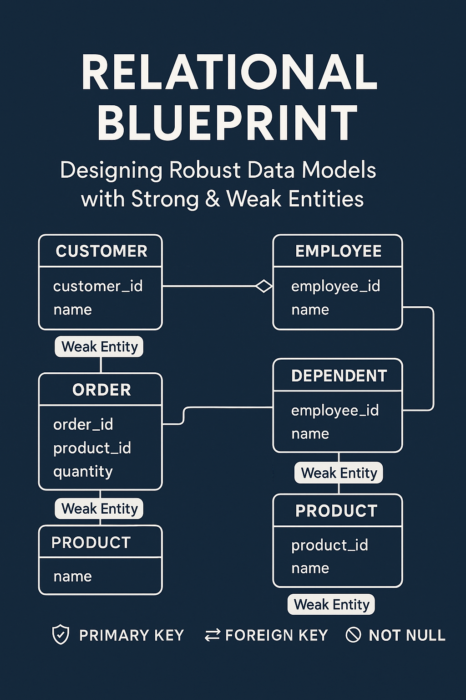

# Docker mysql instructions

If you want to run the database in a container here is a quick and easy way to create a docker container that opens the standard port of 3307 for MYSQL and binds it to 3306.

  $ docker pull mysql:latest

  $ docker run -d --name COP-5725-mysql -e MYSQL_ROOT_PASSWORD=COP5725 -p 3307:3306 mysql

  $ docker exec -it COP-5725-mysql bash

  $ mysql -u root -p

    Enter password: COP5725

# Quarto Markdown Formatting

## Headers Example
'# Header 1'
'## Header 2'

## Images
''

## LINKS
'[Quarto](https://quarto.org)'

## Lists
'* unordered list
  + sub-item 1
  + sub-item 2
    - sub-sub-item 1'

## Tables
'| Right | Left | Default | Center |
|------:|:-----|---------|:------:|
|   12  |  12  |    12   |    12  |
|  123  |  123 |   123   |   123  |
|    1  |    1 |     1   |     1  |'

## Graphs
'```{mermaid}
flowchart LR
  A[Hard edge] --> B(Round edge)
  B --> C{Decision}
  C --> D[Result one]
  C --> E[Result two]
```'

